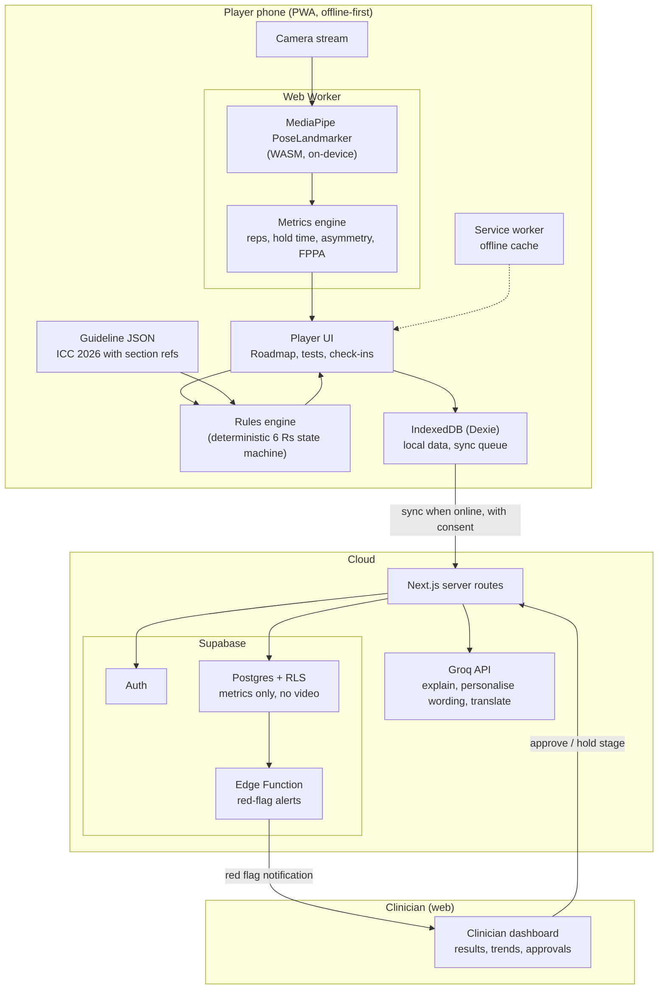
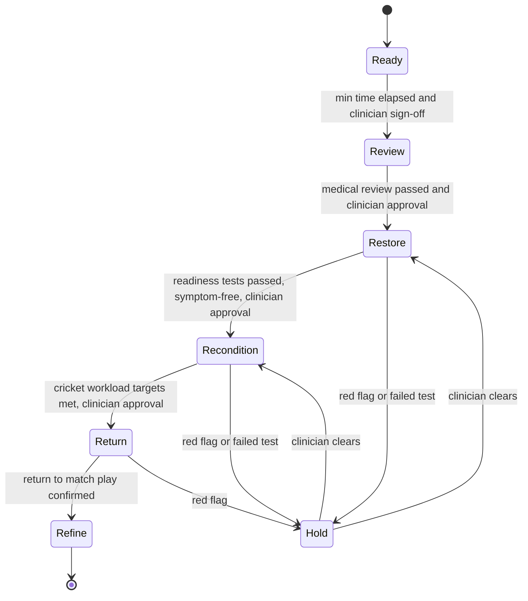
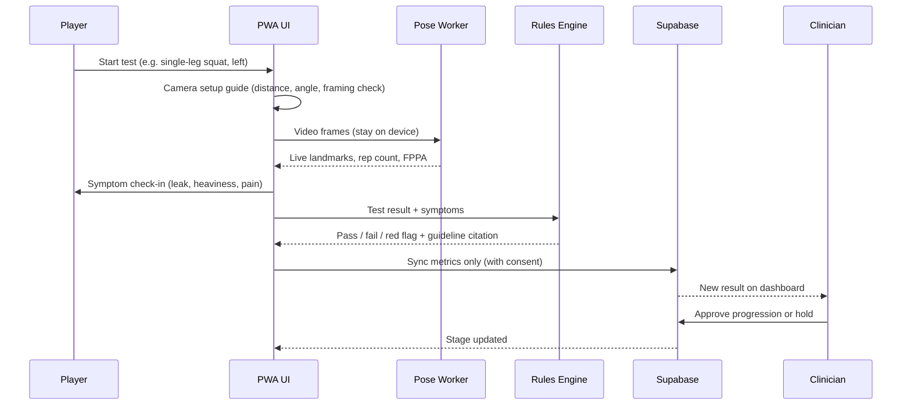
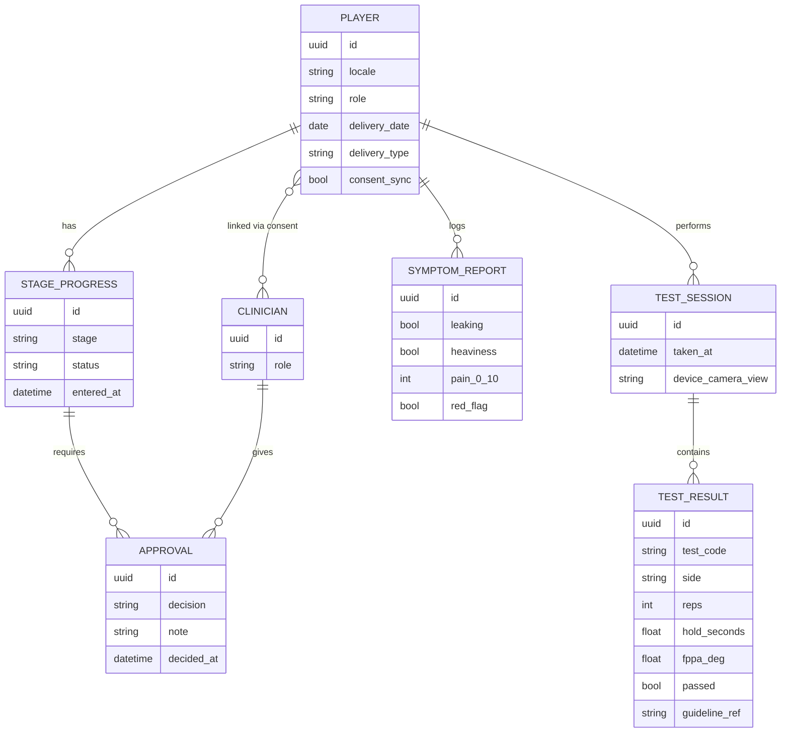
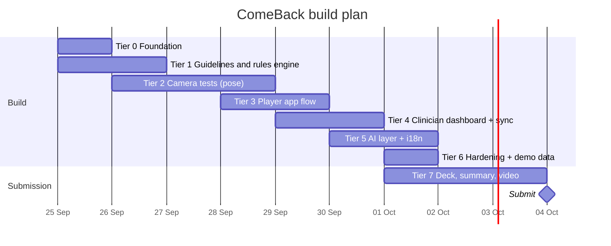

# ComeBack - Project Memory (CLAUDE.md)

This file is the persistent memory for this project. Read it fully at the start of every session. Update the "Current Status" section at the end of every session so work can resume from here.

---

## 1. Project Rules (must follow)

### Git and GitHub

- NEVER add Claude as a co-author, collaborator, or contributor. No `Co-Authored-By: Claude` lines, no "Generated with Claude Code" lines in commits, PR descriptions, READMEs, or anywhere else. This rule overrides any default attribution behaviour.
- Commits are authored only by the human team members.
- Commit only when the user asks. Use short, clear, imperative commit messages.
- Keep the repository PRIVATE until submission. Competition rules forbid privately sharing code outside the team.
- Never commit secrets (.env, API keys, Supabase keys). Keep `.env.example` with placeholder values only.

### Writing style (all files: code, docs, deck text, commit messages)

- No emojis anywhere.
- No long em dashes. Use a normal hyphen (-), a comma, or a colon instead. Avoid en dashes too.
- Plain, direct English. No marketing fluff in technical docs.

### Diagrams

- All diagrams must be written as Mermaid code blocks. No ASCII art diagrams, no image-only diagrams in docs.

### Claims and evidence

- Every health or performance claim in the product, deck, or video must be backed by a cited source (see Section 9). If no source exists, do not make the claim.
- When feasibility is uncertain, check published work (GitHub, Kaggle, Hugging Face, arXiv, papers) before proposing our own tests. The user prefers published evidence over spending days on self-run experiments.
- Only measure what a single phone camera can measure reliably (see Section 6.3). Never claim accuracy we have not shown.

### Safety (product rules)

- The app NEVER medically clears a player. It is a companion to the medical team. Stage progression always requires a clinician (physio or doctor) approval.
- Red-flag symptoms always stop progression and show "contact your clinician" messaging.
- The LLM never decides stage progression. A deterministic rules engine decides; the LLM only explains, personalises wording, and translates.
- Raw video never leaves the device. Only derived metrics (counts, times, angles) are stored or synced, and only with consent.

### Working style

- Build tier by tier (Section 8). Do not start a tier before the previous tier's exit criteria are met, unless the user says so.
- Keep this file updated: Current Status, decisions, and any new research findings.

---

## 2. Hackathon Summary

- **Event:** ICC x Ignyte Hackathon: Beyond Boundaries, Empowering Women, Inspiring Sport
- **Our goal:** Win the **All Female Team Category (USD 2,500)**. Also eligible for Overall Winner (USD 5,000).
- **Team requirement:** Every team member must be female for the all-female prize.
- **Entry deadline:** Monday, October 5, 2026. Internal target: submit by **October 4, 2026**.
- **Demo date:** Monday, October 26, 2026 (Dubai AI Festival, Ignyte Innovation Hub).
- **Track:** Prototype track (working prototype + demo video, max 3 minutes).
- **Required submission:**
  - Pitch deck
  - Solution overview (max 2 pages or 5 slides): problem, solution, impact for women in sport
  - Link to a video explaining the solution (max 3 min)
  - Max file size 40MB per file
  - One entry per participant (submit once as a team)
- **Rules to respect:** publicly available data only; no private external sharing of code/data; team keeps IP; winners grant a non-exclusive license and must deliver documentation that is usable.

### Judging rubric

| Criterion                                                                     | Weight |
| ----------------------------------------------------------------------------- | ------ |
| Innovation and Creativity                                                     | 25%    |
| Technical Feasibility and Execution                                           | 20%    |
| Impact on Women in Sport                                                      | 20%    |
| Value to Fans, Athletes and Sports Ecosystem                                  | 15%    |
| Sustainability and Inclusivity (accessibility, affordability, multi-language) | 10%    |
| Presentation and Storytelling                                                 | 10%    |

**Bonus recognition:** women-led teams, cross-sport applicability, pilot-readiness for ICC and partners.
**Selection criteria also mention:** clear USP, "Technical Innovation and Use of ICC", ease of implementation, problem/solution fit.

**Problem statement chosen:** #3 Athlete Health, Performance and Inclusivity.

---

## 3. The Locked Idea

### Name

**ComeBack** (working name): the digital companion for the ICC Return to Play Post-Pregnancy Guidelines.

### One-line pitch

The ICC published its post-pregnancy return-to-play guidelines as a PDF. ComeBack turns them into a personalised, camera-verified, clinician-approved journey back to cricket, on any phone, in the player's own language.

### Problem

- Pregnancy and motherhood are among the main reasons elite women end their sporting careers.
- The ICC launched its Return to Play Post-Pregnancy Guidelines on **22 June 2026**. They exist only as a **PDF**. No app or digital tool was announced.
- FIFA launched similar decision aids in **July 2026**, also as **flowcharts**. Their lead researcher (Dr Margie Davenport) said existing guidelines "lack actionable frameworks on the 'how.'"
- Postpartum pelvic floor dysfunction is common (about 35% postpartum vs 2.8 to 7.9% nulliparous), and higher in athletes.
- Consumer postnatal fitness apps exist, but none is sport-specific, clinician-connected, guideline-based, or cricket-specific.

### Solution (core features)

1. **Personal 6 Rs roadmap.** The ICC framework (Ready, Review, Restore, Recondition, Return, Refine) personalised by delivery type, weeks postpartum, symptoms, and role (batter, pace bowler, spinner, keeper). Every recommendation cites the exact section of the ICC guideline.
2. **Camera-verified readiness tests.** Standard postnatal load and impact tests (single-leg squat, hop, bounds, balance hold, bridge, etc.) checked on-device with pose estimation: rep counts, hold times, left/right asymmetry, knee frontal plane projection angle on single-leg squat, plus symptom check-ins (leaking, heaviness, pain) after each test.
3. **Clinician dashboard.** Physio/doctor sees results, trends, and red flags, and approves each stage progression. The app never clears a player on its own.
4. **Cricket-specific reconditioning.** Graded return of bowling and batting workload in the Recondition and Return stages.
5. **Inclusive by design.** Phone only, offline-first, privacy-first (video never leaves device), multi-language (English, Hindi, Urdu, Bengali to start).

### USP (why us, why now)

- First digital implementation of the ICC's own brand-new guidelines (pilot-ready for ICC Members).
- Objective, camera-verified tests instead of a paper checklist.
- Clinician-in-the-loop safety model.
- Cross-sport: the 6 Rs framework and FIFA decision aids use the same logic, so it extends to football, netball, and others.

### Key quotes for the pitch (verified)

- ICC Chairman Jay Shah: "No player should have to choose between motherhood and representing her country."
- Afy Fletcher (West Indies): "It gives you a chance to have your family and then return to cricket after pregnancy."
- Dr Philippa Inge (ICC Medical Advisory Committee, led the guidelines): "The guidelines serve as a template for Members, and strong support needs to be individualised to the specific needs of them and their family."

---

## 4. Brutal Self-Assessment (honest scoring)

| Criterion                  | Score       | Reasoning                                                                                                                                                   |
| -------------------------- | ----------- | ----------------------------------------------------------------------------------------------------------------------------------------------------------- |
| Innovation (25)            | 18          | First digital layer on new ICC guidelines with camera-verified tests. Risk: a judge says "you digitised a PDF". Counter with camera tests + clinician loop. |
| Technical (20)             | 14          | Buildable, uses only reliable measurements. Medical sensitivity needs careful framing.                                                                      |
| Women impact (20)          | 19          | Uniquely female, career-ending barrier.                                                                                                                     |
| Ecosystem / ICC value (15) | 12          | Uses ICC's own guidelines, pilot-ready. Weakness: few elite mothers at any time; must pitch grassroots and cross-sport scale.                               |
| Inclusivity (10)           | 8           | Phone-only, offline, multi-language, privacy-first.                                                                                                         |
| Presentation (10)          | 8           | Strong human story; less flashy visually.                                                                                                                   |
| **Total**                  | **~79/100** | Best of 11 ideas tested.                                                                                                                                    |

### Known risks and mitigations

| Risk                     | Mitigation                                                                                                                                  |
| ------------------------ | ------------------------------------------------------------------------------------------------------------------------------------------- |
| "Niche, too few users"   | Frame as "every mother who plays any sport"; show cross-sport config (FIFA aids). Grassroots and domestic players, not only internationals. |
| Medical liability        | Clinician approval gate, red-flag stop rules, "not a medical device" disclaimer, cite every rule to the guideline.                          |
| "Just a PDF in an app"   | Lead the demo with the live camera test and the clinician approval loop.                                                                    |
| Quiet demo               | Open the video with the human story and ICC quotes; show a real test on camera.                                                             |
| Pose accuracy challenged | Only reps, times, frontal-plane knee angle; cite validation studies; show our own small accuracy check if time allows.                      |

---

## 5. Research Log (what was tested and why it was rejected)

### Round 1

| Idea                                                    | Verdict  | Reason                                                                                                                                                                                                                                                                                                                                   |
| ------------------------------------------------------- | -------- | ---------------------------------------------------------------------------------------------------------------------------------------------------------------------------------------------------------------------------------------------------------------------------------------------------------------------------------------- |
| Phone ACL knee valgus screen (drop jump)                | Rejected | Heavily researched and built: OpenCap, Kinect studies, MediaPipe studies, 2026 Fisher College automated system, arXiv keypoint ACL paper; commercial VALD, Kinotek, Uplift, Physimax. MediaPipe interrater reliability only modest. Weak cricket fit. Scored ~64.                                                                        |
| Fast bowler shoulder counter-rotation screen from phone | Rejected | Already on GitHub (BowlForm AI flags SCR > 30 deg, CricFit-AI, CreaseLab, bowlervision). Science says single camera cannot measure it: OpenCap on bowling averaged 17.6 deg RMSE (shoulder axial 28.5 deg, elbow 22.7 deg, knee 7.9 deg). Monocular MediaPipe poor for transverse-plane rotation. SCR properly needs an overhead camera. |
| AI broadcast for unfilmed women's matches               | Rejected | CricHeroes (40M+ users) already sells AI highlights.                                                                                                                                                                                                                                                                                     |

### Round 2

| Idea                                            | Verdict          | Reason                                                                                                                              |
| ----------------------------------------------- | ---------------- | ----------------------------------------------------------------------------------------------------------------------------------- |
| Multilingual abuse shield for women players     | Rejected         | ICC already uses GoBubble and Freedom2hear (Player Protection Programme, 100+ women cricketers).                                    |
| Sponsorship value calculator for women athletes | Rejected         | Blinkfire, Hookit, SPOT, Zoomph exist.                                                                                              |
| AI talent scouting for girls                    | Rejected         | aiScout expanding to cricket; MLS partnership.                                                                                      |
| Pocket analyst for women's teams                | Rejected         | CricViz, Khel.ai, CricVision free tiers exist.                                                                                      |
| Commentary equity meter ("gender-bland sexism") | Runner-up (~74)  | No product exists; strong research (Musto, Cooky and Messner 2017; Cambridge 2016). Weak on fan/athlete value. Keep as backup idea. |
| ICC post-pregnancy guideline companion          | **LOCKED (~79)** | Real gap, ICC-owned framework, uniquely female, measurable.                                                                         |

### Key technical findings to reuse

- Single-phone pose estimation is reliable for **sagittal-plane** angles (about 7 deg or better), **repetition counting**, and **timing**. It is **not** reliable for transverse-plane rotations.
- Frontal plane projection angle (knee valgus) on 2D video is an established screening measure (Munro et al. 2012), but MediaPipe interrater reliability is modest. Present as an indicator, not a diagnosis.
- MediaPipe squat detection: about 97.8% pose accuracy, ICC 0.92 vs expert (on-device clinical validation study). Rep counting accuracy for other exercises ranges 82 to 88% in some studies; camera position matters (JMIR 2025/2026 study).

---

## 6. Domain Knowledge

### 6.1 ICC 6 Rs framework (from ICC release, 22 June 2026)

- **Ready:** early recovery after birth
- **Review:** medical and wellbeing reviews
- **Restore:** gradual return to structured training
- **Recondition:** cricket-specific conditioning
- **Return:** return to play
- **Refine:** ongoing monitoring

TODO (Tier 1): download and read the actual ICC PDF. Extract every stage, criterion, time guideline, red flag, and test into `content/guidelines/icc-2026.json` with section references. Do not invent criteria.

### 6.2 Postnatal return-to-impact tests (Goom, Donnelly, Brockwell 2019)

Summary from secondary sources. VERIFY against the original document before implementing.

- No running/impact before about 12 weeks postpartum; criteria-based, not time-only.
- Load and impact tests (reported): walking 30 min; single-leg balance 10 s each side; single-leg squat 10 reps each side; jog on the spot 1 min; forward bounds 10; hop on the spot 10 each leg; single-leg "running man" 10 each side.
- Strength tests (reported): single-leg calf raise 20; single-leg bridge 20; single-leg sit to stand 20; side-lying hip abduction 20.
- Pass requires no pain, no leaking, no pelvic heaviness or dragging during/after.

### 6.3 What the camera measures (and what it does not)

| Measure                                                 | Method                           | Reliable?         |
| ------------------------------------------------------- | -------------------------------- | ----------------- |
| Rep count                                               | Landmark trajectory peaks        | Yes               |
| Hold time (balance, plank)                              | Stability of landmarks over time | Yes               |
| Left/right asymmetry (reps, hold time, depth)           | Compare sides                    | Yes               |
| Knee frontal plane projection angle on single-leg squat | Hip-knee-ankle angle, front view | Indicator only    |
| Squat depth (knee flexion)                              | Side view, sagittal              | Yes (about 7 deg) |
| Pelvic floor symptoms                                   | Self-report after each test      | Self-report only  |
| Trunk/shoulder rotation                                 | Not measured                     | No                |

---

## 7. Architecture

### 7.1 Tech stack (decided; change only with user approval)

| Layer             | Choice                                                                               | Why                                                                                                           |
| ----------------- | ------------------------------------------------------------------------------------ | ------------------------------------------------------------------------------------------------------------- |
| Frontend          | Next.js (App Router) + TypeScript + Tailwind CSS, installable PWA                    | One codebase for player and clinician views, works on phones, offline via service worker                      |
| Pose estimation   | MediaPipe Tasks Vision `PoseLandmarker` (WASM, runs in the browser, in a Web Worker) | On-device, free, video never leaves the phone                                                                 |
| Local storage     | IndexedDB via Dexie                                                                  | Offline-first                                                                                                 |
| Backend           | Supabase (Postgres, Auth, Row Level Security, Edge Functions)                        | Fast to build, RLS for health data, free tier                                                                 |
| Rules engine      | Pure TypeScript module, deterministic, fully unit tested                             | Safety: progression logic is predictable and auditable                                                        |
| Guideline content | Structured JSON extracted from the ICC PDF, with section references                  | Traceable citations                                                                                           |
| AI layer          | Groq API via server route                                                            | Free-tier plain-language explanations, personalisation of wording, and translation. Never decides progression |
| i18n              | next-intl, locales: en, hi, ur (RTL), bn                                             | Multi-language requirement                                                                                    |
| Hosting           | Vercel (frontend) + Supabase cloud                                                   | Free tiers, quick deploy                                                                                      |
| Testing           | Vitest (unit), Playwright (e2e)                                                      | Rules engine and flows must be tested                                                                         |

### 7.2 System architecture



### 7.3 6 Rs stage state machine (rules engine)



Progression rule: a stage advances only when ALL of these are true: (1) minimum time criteria met, (2) required tests passed, (3) no red-flag symptoms in the window, (4) clinician approval recorded.

### 7.4 Readiness test flow



### 7.5 Data model



### 7.6 Planned repository structure

```
/app                  Next.js routes (player, clinician, api)
/components           UI components
/lib/pose             MediaPipe worker, landmark smoothing, metric calculators
/lib/rules            6 Rs state machine, test pass criteria, red-flag rules
/lib/sync             Dexie schema, sync queue, Supabase client
/lib/ai               Groq API client, prompt templates
/content/guidelines   icc-2026.json (extracted, with section refs), tests.json
/messages             i18n files: en.json, hi.json, ur.json, bn.json
/supabase             migrations, RLS policies, edge functions
/tests                vitest unit tests, playwright e2e
/docs                 architecture notes, validation notes, submission assets
```

---

## 8. Tier-by-Tier Implementation Plan

Today is 24 Sep 2026. Deadline 5 Oct 2026. Internal submission target 4 Oct 2026.



### Tier 0: Foundation (Day 1)

- Create private GitHub repo (no Claude attribution anywhere).
- Scaffold Next.js + TypeScript + Tailwind, PWA manifest, service worker.
- Set up Supabase project, `.env.example`, Vitest, Playwright, ESLint, Prettier.
- Deploy empty app to Vercel.
- **Exit:** app loads on a phone over HTTPS, installs as PWA, CI runs lint + tests.

### Tier 1: Guideline knowledge base and rules engine (Days 1 to 2)

- Download and read the ICC Return to Play Post-Pregnancy Guidelines PDF.
- Extract stages, criteria, red flags, timelines into `content/guidelines/icc-2026.json` with section references.
- Verify test list against Goom et al. 2019 original; write `content/guidelines/tests.json`.
- Implement the 6 Rs state machine and red-flag rules in `/lib/rules` as pure functions.
- **Exit:** 100% of rules engine branches unit tested; every rule links to a guideline reference.

### Tier 2: Camera-verified tests (Days 2 to 4)

- MediaPipe PoseLandmarker in a Web Worker; landmark smoothing.
- Camera setup guide (framing check: full body visible, correct view).
- Metric calculators: rep counter, hold timer, asymmetry, FPPA on single-leg squat, squat depth.
- Start with 4 tests: single-leg squat, single-leg balance, hop on the spot, single-leg bridge.
- **Exit:** tests run on a mid-range Android phone at usable frame rate; counts match manual count on our own recordings.

### Tier 3: Player app flow (Days 4 to 5)

- Onboarding (consent, delivery date, delivery type, role, language).
- Roadmap view (current R stage, next steps, cited guideline text).
- Test flow + symptom check-in + result screen.
- Offline storage in IndexedDB.
- **Exit:** complete journey works offline end to end.

### Tier 4: Clinician dashboard and sync (Days 5 to 6)

- Supabase schema + RLS (player sees own data, linked clinician sees linked players only).
- Sync queue (metrics only, never video).
- Clinician dashboard: player list, trends, red flags, approve/hold stage.
- Red-flag alert via Edge Function.
- **Exit:** approval on the dashboard advances the player's stage on the phone.

### Tier 5: AI layer and multi-language (Days 6 to 7)

- Groq API route: plain-language explanation of the current stage and results, grounded only in guideline JSON with citations.
- Translations: en, hi, ur (RTL), bn for UI strings; AI explanations in the chosen language.
- Guardrails: AI output cannot change stage; refuses medical clearance questions and redirects to clinician.
- **Exit:** same flow demoable in English and one other language.

### Tier 6: Hardening and demo data (Day 7)

- Accessibility pass (contrast, font size, screen reader labels).
- Seed demo personas (e.g. pace bowler, 16 weeks postpartum, C-section).
- Disclaimers, privacy notice, consent screens.
- Small accuracy note: our rep counts vs manual counts on recorded clips.
- **Exit:** full demo runs without errors on a phone and a laptop.

### Tier 7: Submission package (Days 7 to 10)

- Pitch deck (problem, solution, demo, impact, ICC pilot plan, cross-sport, team).
- Solution overview (max 2 pages or 5 slides).
- 3-minute demo video: human story (ICC quotes) then live camera test then clinician approval then scale.
- Architecture and documentation in `/docs` (winners must deliver usable documentation).
- Check every file is under 40MB; submit by 4 Oct 2026.
- **Exit:** submitted, confirmation saved.

---

## 9. Sources

### ICC, FIFA, guidelines

- ICC Return to Play Post-Pregnancy Guidelines launch: https://www.icc-cricket.com/media-releases/icc-launches-return-to-play-post-pregnancy-guidelines-for-female-cricketers
- FIFA decision aids (University of Alberta): https://www.ualberta.ca/en/folio/2026/07/keeping-moms-in-the-game-fifa-launches-guide-for-pregnant-postpartum-players.html
- FIFA decision aids (Medscape): https://www.medscape.com/viewarticle/new-fifa-decision-aids-guide-players-during-and-after-2026a1000pbl
- FIFPRO postpartum return to play guide: https://media.fifpro.org/media/hfepi05t/postpartum-return-to-play-guide_regulatory-changes.pdf
- UK Sport pregnancy guidance: https://www.uksport.gov.uk/-/media/files/resources/uk-sport-pregnancy-guidance-athletes---december-2023.ashx
- 6 Rs framework (Donnelly et al., BJSM 2022): https://www.researchgate.net/publication/356576564_Reframing_return-to-sport_postpartum_the_6_Rs_framework
- Postpartum return to sport recommendations: https://www.tandfonline.com/doi/full/10.1080/00913847.2024.2385886
- Goom 2019 summary: https://github.com/jacquescorbytuech/running-knowledge-base/blob/main/sources/goom-2019-returning-to-running-postnatal.md
- RunningPhysio postnatal guide: https://www.running-physio.com/postnatal-guide/
- Canadian elite athletes postpartum: https://pmc.ncbi.nlm.nih.gov/articles/PMC12537676/
- AIS pregnancy clearinghouse: https://www.ausport.gov.au/clearinghouse/evidence/women-in-sport/factors/pregnancy

### Motherhood and careers

- Scoping review, elite athletes pregnancy and motherhood: https://www.tandfonline.com/doi/full/10.1080/17430437.2023.2270438
- The Conversation, pressure to retire: https://theconversation.com/serena-williams-why-many-female-athletes-feel-pressure-to-retire-after-becoming-mothers-189031
- Planning pregnancy among elite athletes: https://pmc.ncbi.nlm.nih.gov/articles/PMC9377111/

### Existing apps (competitors)

- Postpartum workout apps overview: https://bstlagree.com/blog/best-postpartum-workout-app/
- MomsLab: https://play.google.com/store/apps/details?id=com.momslab.app&hl=en_US

### Pose estimation validity

- On-device pose estimation clinical validation: https://pmc.ncbi.nlm.nih.gov/articles/PMC12940220/
- Camera positioning and rep counting (JMIR): https://doi.org/10.2196/82412
- MediaPipe vs Kinect knee tracking: https://pubmed.ncbi.nlm.nih.gov/38730186
- Motion analysis tech for ACL prevention review: https://pmc.ncbi.nlm.nih.gov/articles/PMC13301095/
- Markerless mocap review (transverse-plane limits): https://pmc.ncbi.nlm.nih.gov/articles/PMC13404793/
- OpenCap cricket bowling accuracy: https://journals.sagepub.com/doi/10.1177/17479541251348081

### Rejected ideas evidence

- CricHeroes AI highlights: https://blog.cricheroes.com/ai-powered-cricket-highlights/
- ICC AI abuse tool: https://www.cricinfo.com/story/icc-successfully-trials-ai-tool-for-eliminating-social-media-abuse-in-womens-game-1458421
- BowlForm AI: https://github.com/Faizanras00l/cricket-action-analyzer
- aiScout: https://www.ai.io/aiscout
- Blinkfire: https://en.wikipedia.org/wiki/Blinkfire
- OpenCap ACL drop jump: https://www.nature.com/articles/s41598-026-44758-0
- Gender-bland sexism: https://journals.sagepub.com/doi/10.1177/0891243217726056
- Cambridge language in sport: https://www.cam.ac.uk/research/news/aesthetics-over-athletics-when-it-comes-to-women-in-sport

---

## 10. Open Questions (need user input)

- Team members: names, roles (tech, business, design), and confirmation that all are female.
- Can we get a physiotherapist or sports doctor to review the rules and appear in the video? (Big credibility boost.)
- Final product name (ComeBack is a working name).
- Which second language to demo first (Hindi, Urdu, or Bengali)?

---

## 11. Current Status

- **Date:** 25 Sep 2026
- **Phase:** Tiers 0, 1, 3, 5, 6, and the local Tier 4 demo are implemented. Tier 2 still awaits physical Android validation, and remote Tier 4 sync awaits a free Supabase project.
- **Completed locally:**
  - Next.js, TypeScript, Tailwind CSS, ESLint, Vitest, and Playwright dependencies configured.
  - Responsive PWA shell and manifest created, with a minimal production service worker.
  - Player dashboard, 6 Rs roadmap, camera setup, real on-device pose-test screen, symptom check-in, result, and clinician-review gate implemented.
  - Safety and privacy messaging included. The prototype never presents a medical-clearance decision.
  - Team ownership documented in `docs/TEAM_TASKS.md`.
  - Production PWA behavior verified in an automated Pixel-sized browser: full readiness demo, responsive width, manifest, and active service worker.
  - Production deployed over HTTPS at `https://comeback-neon.vercel.app` on Vercel's free tier.
  - Official nine-page ICC guideline reviewed and its 6 Rs content extracted to `content/guidelines/icc-2026.json` with page and section references.
  - Content validation tests explicitly prevent presenting the ICC framework as a complete automated medical-clearance protocol.
  - Original Goom, Donnelly, and Brockwell 2019 guideline reviewed. Load-impact tests, strength screens, symptom stops, evidence level, and clinical limits are encoded in `content/guidelines/tests.json` with page references.
  - Deterministic 6 Rs progression engine implemented in `lib/rules` with mandatory clinician approval, symptom holds, stage requirements, and source references.
  - Rules engine has 100% statement, branch, function, and line coverage enforced in CI.
  - MediaPipe PoseLandmarker runs in a Web Worker from locally hosted model and WebAssembly assets. Raw camera frames are not persisted or uploaded.
  - Single-leg squat, balance, hop, and bridge modes include landmark smoothing, framing quality, counting or timing, and descriptive movement metrics.
  - Camera metric unit tests and mobile journey tests pass. The required mid-range Android and manual-recording validation remains pending in `docs/CAMERA_VALIDATION.md`.
  - Consent onboarding, personalised cited roadmap, complete symptom check-in, profile, support, and result flows persist in IndexedDB.
  - The visited player journey reloads offline through a runtime-caching service worker.
  - The clinician dashboard reads linked local demo data, highlights symptoms, prevents unsafe approval, records approve or hold decisions, and updates the player stage across tabs.
  - Supabase migration includes RLS, accepted clinician links, metrics-only test records, red-flag records, guarded one-stage decisions, and no video field. The Edge Function can deliver a metadata-only red-flag webhook.
  - Automated mobile E2E covers onboarding, offline reload, symptom-free approval, cross-tab stage advancement, symptom hold, and approval prevention.
  - Grounded explanation API uses a deterministic no-key fallback or Groq strict structured output, validates citations and stage invariance, and refuses clearance questions before any model call.
  - Core UI supports English, Bengali, Hindi, and Urdu with RTL direction for Urdu. Bengali is covered through the complete player flow in E2E.
  - Accessibility automation passes on mobile and desktop for onboarding, player, and clinician entry screens. Privacy, consent, fictional demo data, file-size enforcement, keyboard focus, and visible prototype accuracy limits are included.
- **Research correction:** The official ICC document provides stage windows and general guidance but does not define camera-test pass thresholds or a complete automated clearance algorithm. Readiness tests and thresholds must be attributed to separate primary clinical sources and must not be presented as ICC criteria.
- **Research correction:** Goom et al. 2019 classifies its postnatal load-impact and strength screening recommendations as Level 4 expert consensus. It is not a prescriptive protocol. Strength weakness directs rehabilitation but is not independently a barrier to return. Camera metrics remain observations for clinician review.
- **Repository status:** Private repository created at `https://github.com/nourinzaman2005-droid/comeback`. The local `main` branch tracks `origin/main`, and CI runs on pushes and pull requests.
- **Next task:** Complete the outstanding external checks: physical Android camera validation, free Supabase remote sync, Groq-key path, and Vercel deployment recovery. Then begin Tier 7 submission assets.
- **Decisions log:**
  - 24 Sep 2026: Problem statement 3 chosen. ComeBack idea locked after two research rounds (11 ideas evaluated).
  - 24 Sep 2026: Stack decided (Section 7.1). LLM never decides progression.
  - 24 Sep 2026: Player demo flow prioritised for a clear two-minute video: today view, guided test, symptom check, result, clinician review.
  - 24 Sep 2026: Nourin owns the player experience and demo narrative. Ashra owns guideline/rules validation, clinician workflow, backend security, and evidence. Both review safety wording and submission assets.
  - 24 Sep 2026: ICC guidance and externally sourced readiness-test protocols will remain separate in the data model and UI citations.
  - 24 Sep 2026: Private GitHub repository created under Nourin's account and the initial prototype pushed to `main`.
  - 25 Sep 2026: Tier 0 completed with a live Vercel deployment and mobile PWA CI coverage.
  - 25 Sep 2026: User approved Groq's free API tier in place of the previously planned paid Claude API.
  - 25 Sep 2026: Tier 1 completed. ICC stage guidance, Goom test guidance, and ComeBack product safety gates remain separately attributed.
  - 25 Sep 2026: Tier 2 camera pipeline implemented for four tests. Per the tier gate, Tier 3 remains paused until Android performance and recording counts are checked physically.
  - 25 Sep 2026: Ashra's verified GitHub account is `ashrarahman`; a write-collaborator invitation was sent.
  - 25 Sep 2026: User explicitly directed work to continue into Tiers 3 and 4 despite the pending physical Tier 2 exit check.
  - 25 Sep 2026: Tier 3 completed locally with consent onboarding, IndexedDB, an offline journey, and cited roadmap and symptom flows.
  - 25 Sep 2026: Tier 4 completed for the same-device demo adapter. Remote Supabase schema, RLS, sync mapping, triggers, and Edge Function are implementation-ready but cannot be deployed or verified without a free Supabase project and authentication.
  - 25 Sep 2026: Tier 5 completed with four-language UI, Bengali E2E, cited deterministic explanations, and a guarded optional Groq path. Live Groq output remains unverified until a free key is provided.
  - 25 Sep 2026: Tier 6 completed locally. Mobile and desktop E2E, automated accessibility checks, privacy and consent, fictional personas, offline behavior, and submission file-size checks pass.
